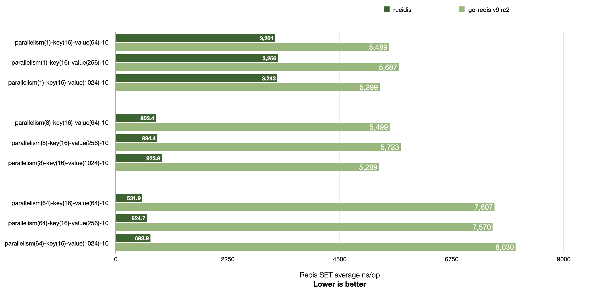
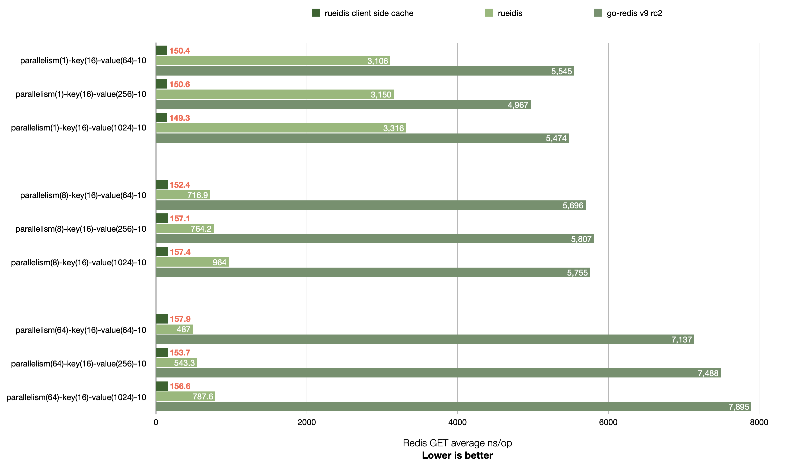
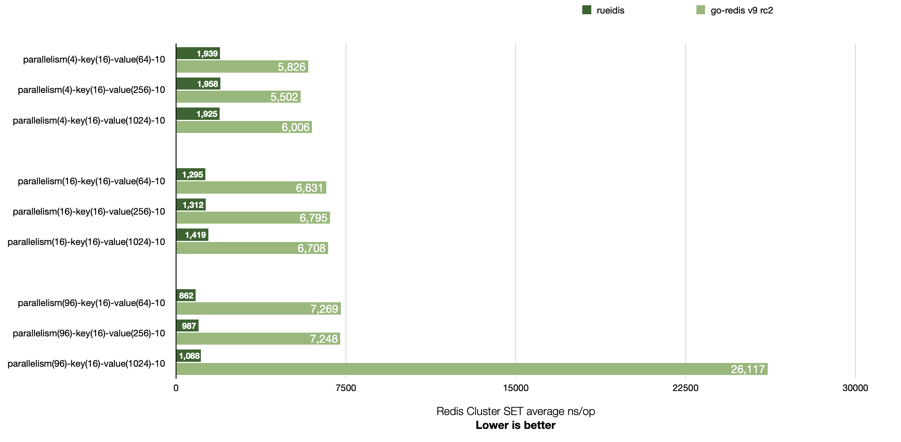

# Rueidis Benchmark
This is a benchmark repository for https://github.com/rueian/rueidis

## Benchmark comparison with go-redis v9

Rueidis has higher throughput than go-redis v9 across 1, 8, and 64 parallelism settings.

It is even able to achieve ~14x throughput over go-redis in a local benchmark of Macbook Pro 16" M1 Pro 2021. (see `parallelism(64)-key(16)-value(64)-10`)

## Redis SET



```shell
# run redis-server 7.0.5 at 127.0.0.1:6379
▶ ./redis-server --save "" --appendonly no
▶ go test -bench=BenchmarkSingleClientSet -benchmem -benchtime 2s .
goos: darwin
goarch: arm64
pkg: rueidis-benchmark
BenchmarkSingleClientSet/Rueidis-parallelism(1)-key(16)-value(64)-10         	  736764	      3201 ns/op	       4 B/op	       1 allocs/op
BenchmarkSingleClientSet/GoRedis-parallelism(1)-key(16)-value(64)-10         	  435904	      5489 ns/op	     256 B/op	       9 allocs/op
BenchmarkSingleClientSet/Rueidis-parallelism(1)-key(16)-value(256)-10        	  734452	      3256 ns/op	       7 B/op	       2 allocs/op
BenchmarkSingleClientSet/GoRedis-parallelism(1)-key(16)-value(256)-10        	  447597	      5687 ns/op	     256 B/op	       9 allocs/op
BenchmarkSingleClientSet/Rueidis-parallelism(1)-key(16)-value(1024)-10       	  626404	      3243 ns/op	       8 B/op	       2 allocs/op
BenchmarkSingleClientSet/GoRedis-parallelism(1)-key(16)-value(1024)-10       	  450150	      5299 ns/op	     256 B/op	       9 allocs/op
BenchmarkSingleClientSet/Rueidis-parallelism(8)-key(16)-value(64)-10         	 2995470	       803.4 ns/op	       4 B/op	       1 allocs/op
BenchmarkSingleClientSet/GoRedis-parallelism(8)-key(16)-value(64)-10         	  458808	      5499 ns/op	     257 B/op	       9 allocs/op
BenchmarkSingleClientSet/Rueidis-parallelism(8)-key(16)-value(256)-10        	 2856110	       834.4 ns/op	       7 B/op	       2 allocs/op
BenchmarkSingleClientSet/GoRedis-parallelism(8)-key(16)-value(256)-10        	  428572	      5723 ns/op	     258 B/op	       9 allocs/op
BenchmarkSingleClientSet/Rueidis-parallelism(8)-key(16)-value(1024)-10       	 2588378	       923.8 ns/op	       8 B/op	       2 allocs/op
BenchmarkSingleClientSet/GoRedis-parallelism(8)-key(16)-value(1024)-10       	  446240	      5289 ns/op	     257 B/op	       9 allocs/op
BenchmarkSingleClientSet/Rueidis-parallelism(64)-key(16)-value(64)-10        	 4118238	       531.9 ns/op	       4 B/op	       1 allocs/op
BenchmarkSingleClientSet/GoRedis-parallelism(64)-key(16)-value(64)-10        	  328214	      7607 ns/op	     294 B/op	       9 allocs/op
BenchmarkSingleClientSet/Rueidis-parallelism(64)-key(16)-value(256)-10       	 3880988	       624.7 ns/op	       7 B/op	       2 allocs/op
BenchmarkSingleClientSet/GoRedis-parallelism(64)-key(16)-value(256)-10       	  320084	      7570 ns/op	     294 B/op	       9 allocs/op
BenchmarkSingleClientSet/Rueidis-parallelism(64)-key(16)-value(1024)-10      	 3418170	       693.9 ns/op	       8 B/op	       2 allocs/op
BenchmarkSingleClientSet/GoRedis-parallelism(64)-key(16)-value(1024)-10      	  306708	      8030 ns/op	     295 B/op	       9 allocs/op
PASS
ok  	rueidis-benchmark	53.795s
```

## Redis GET

Rueidis supports Redis 6 server-assisted client side caching. It is able to get more throughput if cache hit.



```shell
# run redis-server 7.0.5 at 127.0.0.1:6379
▶ ./redis-server --save "" --appendonly no
▶ go test -bench=BenchmarkSingleClientGet -benchmem -benchtime 2s .
goos: darwin
goarch: arm64
pkg: rueidis-benchmark
BenchmarkSingleClientGet/RueiCSC-parallelism(1)-key(16)-value(64)-10         	16567357	       150.4 ns/op	       0 B/op	       0 allocs/op
BenchmarkSingleClientGet/Rueidis-parallelism(1)-key(16)-value(64)-10         	  773707	      3106 ns/op	      64 B/op	       1 allocs/op
BenchmarkSingleClientGet/GoRedis-parallelism(1)-key(16)-value(64)-10         	  463239	      5545 ns/op	     268 B/op	       8 allocs/op
BenchmarkSingleClientGet/RueiCSC-parallelism(1)-key(16)-value(256)-10        	15726266	       150.6 ns/op	       0 B/op	       0 allocs/op
BenchmarkSingleClientGet/Rueidis-parallelism(1)-key(16)-value(256)-10        	  756891	      3150 ns/op	     256 B/op	       1 allocs/op
BenchmarkSingleClientGet/GoRedis-parallelism(1)-key(16)-value(256)-10        	  445144	      4967 ns/op	     476 B/op	       8 allocs/op
BenchmarkSingleClientGet/RueiCSC-parallelism(1)-key(16)-value(1024)-10       	16112798	       149.3 ns/op	       0 B/op	       0 allocs/op
BenchmarkSingleClientGet/Rueidis-parallelism(1)-key(16)-value(1024)-10       	  725988	      3316 ns/op	    1024 B/op	       1 allocs/op
BenchmarkSingleClientGet/GoRedis-parallelism(1)-key(16)-value(1024)-10       	  462140	      5474 ns/op	    1340 B/op	       8 allocs/op
BenchmarkSingleClientGet/RueiCSC-parallelism(8)-key(16)-value(64)-10         	15352110	       152.4 ns/op	       0 B/op	       0 allocs/op
BenchmarkSingleClientGet/Rueidis-parallelism(8)-key(16)-value(64)-10         	 3247376	       716.9 ns/op	      64 B/op	       1 allocs/op
BenchmarkSingleClientGet/GoRedis-parallelism(8)-key(16)-value(64)-10         	  456474	      5696 ns/op	     269 B/op	       8 allocs/op
BenchmarkSingleClientGet/RueiCSC-parallelism(8)-key(16)-value(256)-10        	15924390	       157.1 ns/op	       0 B/op	       0 allocs/op
BenchmarkSingleClientGet/Rueidis-parallelism(8)-key(16)-value(256)-10        	 3101877	       764.2 ns/op	     256 B/op	       1 allocs/op
BenchmarkSingleClientGet/GoRedis-parallelism(8)-key(16)-value(256)-10        	  468114	      5807 ns/op	     478 B/op	       8 allocs/op
BenchmarkSingleClientGet/RueiCSC-parallelism(8)-key(16)-value(1024)-10       	15593329	       157.4 ns/op	       0 B/op	       0 allocs/op
BenchmarkSingleClientGet/Rueidis-parallelism(8)-key(16)-value(1024)-10       	 2437881	       964.0 ns/op	    1024 B/op	       1 allocs/op
BenchmarkSingleClientGet/GoRedis-parallelism(8)-key(16)-value(1024)-10       	  435168	      5755 ns/op	    1342 B/op	       8 allocs/op
BenchmarkSingleClientGet/RueiCSC-parallelism(64)-key(16)-value(64)-10        	15187882	       157.9 ns/op	       0 B/op	       0 allocs/op
BenchmarkSingleClientGet/Rueidis-parallelism(64)-key(16)-value(64)-10        	 5190792	       487.0 ns/op	      64 B/op	       1 allocs/op
BenchmarkSingleClientGet/GoRedis-parallelism(64)-key(16)-value(64)-10        	  320002	      7137 ns/op	     306 B/op	       8 allocs/op
BenchmarkSingleClientGet/RueiCSC-parallelism(64)-key(16)-value(256)-10       	15558577	       153.7 ns/op	       0 B/op	       0 allocs/op
BenchmarkSingleClientGet/Rueidis-parallelism(64)-key(16)-value(256)-10       	 4336953	       543.3 ns/op	     256 B/op	       1 allocs/op
BenchmarkSingleClientGet/GoRedis-parallelism(64)-key(16)-value(256)-10       	  307315	      7488 ns/op	     511 B/op	       8 allocs/op
BenchmarkSingleClientGet/RueiCSC-parallelism(64)-key(16)-value(1024)-10      	15467998	       156.6 ns/op	       0 B/op	       0 allocs/op
BenchmarkSingleClientGet/Rueidis-parallelism(64)-key(16)-value(1024)-10      	 2962038	       787.6 ns/op	    1024 B/op	       1 allocs/op
BenchmarkSingleClientGet/GoRedis-parallelism(64)-key(16)-value(1024)-10      	  331707	      7895 ns/op	    1377 B/op	       8 allocs/op
PASS
ok  	rueidis-benchmark	80.789s
```

## Redis Cluster GET



```shell
▶ ./redis-server --port 7001 --save "" --appendonly no --cluster-enabled yes --cluster-config-file 7001.conf
▶ ./redis-server --port 7002 --save "" --appendonly no --cluster-enabled yes --cluster-config-file 7002.conf
▶ ./redis-server --port 7003 --save "" --appendonly no --cluster-enabled yes --cluster-config-file 7003.conf
▶ ./redis-cli --cluster create 127.0.0.1:7001 127.0.0.1:7002 127.0.0.1:7003 --cluster-yes
▶ go test -bench=BenchmarkClusterClientSet -benchmem -benchtime 2s .
goos: darwin
goarch: arm64
pkg: rueidis-benchmark
BenchmarkClusterClientSet/Rueidis-parallelism(4)-key(16)-value(64)-10         	 1293139	      1939 ns/op	       4 B/op	       1 allocs/op
BenchmarkClusterClientSet/GoRedis-parallelism(4)-key(16)-value(64)-10         	  466309	      5826 ns/op	     258 B/op	       9 allocs/op
BenchmarkClusterClientSet/Rueidis-parallelism(4)-key(16)-value(256)-10        	 1328289	      1958 ns/op	       7 B/op	       2 allocs/op
BenchmarkClusterClientSet/GoRedis-parallelism(4)-key(16)-value(256)-10        	  434082	      5502 ns/op	     259 B/op	       9 allocs/op
BenchmarkClusterClientSet/Rueidis-parallelism(4)-key(16)-value(1024)-10       	 1279952	      1925 ns/op	       8 B/op	       2 allocs/op
BenchmarkClusterClientSet/GoRedis-parallelism(4)-key(16)-value(1024)-10       	  354634	      6006 ns/op	     259 B/op	       9 allocs/op
BenchmarkClusterClientSet/Rueidis-parallelism(16)-key(16)-value(64)-10        	 1930472	      1295 ns/op	       4 B/op	       1 allocs/op
BenchmarkClusterClientSet/GoRedis-parallelism(16)-key(16)-value(64)-10        	  306332	      6631 ns/op	     271 B/op	       9 allocs/op
BenchmarkClusterClientSet/Rueidis-parallelism(16)-key(16)-value(256)-10       	 1795843	      1312 ns/op	       7 B/op	       2 allocs/op
BenchmarkClusterClientSet/GoRedis-parallelism(16)-key(16)-value(256)-10       	  360283	      6795 ns/op	     270 B/op	       9 allocs/op
BenchmarkClusterClientSet/Rueidis-parallelism(16)-key(16)-value(1024)-10      	 1599168	      1419 ns/op	       8 B/op	       2 allocs/op
BenchmarkClusterClientSet/GoRedis-parallelism(16)-key(16)-value(1024)-10      	  352539	      6708 ns/op	     270 B/op	       9 allocs/op
BenchmarkClusterClientSet/Rueidis-parallelism(96)-key(16)-value(64)-10        	 3074872	       862.2 ns/op	       4 B/op	       1 allocs/op
BenchmarkClusterClientSet/GoRedis-parallelism(96)-key(16)-value(64)-10        	  319161	      7269 ns/op	     334 B/op	       9 allocs/op
BenchmarkClusterClientSet/Rueidis-parallelism(96)-key(16)-value(256)-10       	 2738989	       987.1 ns/op	       7 B/op	       2 allocs/op
BenchmarkClusterClientSet/GoRedis-parallelism(96)-key(16)-value(256)-10       	  307905	      7248 ns/op	     334 B/op	       9 allocs/op
BenchmarkClusterClientSet/Rueidis-parallelism(96)-key(16)-value(1024)-10      	 2277546	      1088 ns/op	       8 B/op	       2 allocs/op
BenchmarkClusterClientSet/GoRedis-parallelism(96)-key(16)-value(1024)-10      	  192602	     26117 ns/op	     363 B/op	       9 allocs/op
PASS
ok  	rueidis-benchmark	71.420s
```

