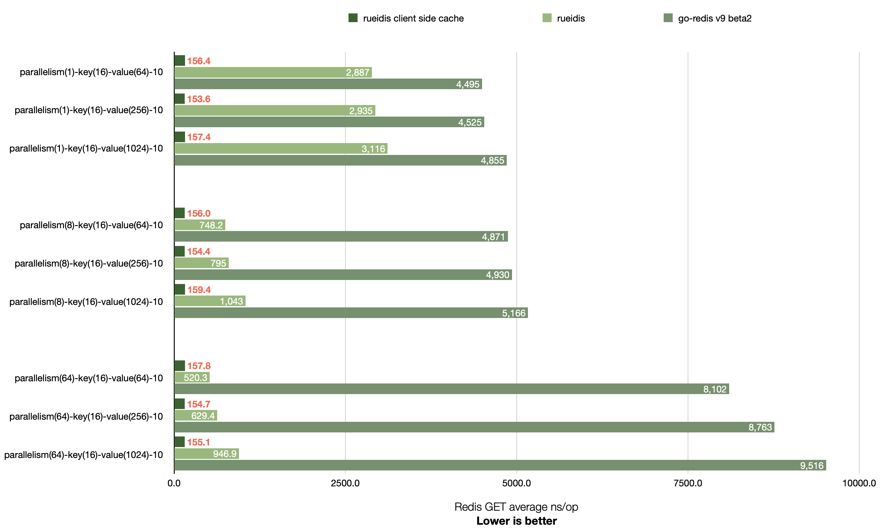

# Rueidis Benchmark
This is a benchmark repository for https://github.com/rueian/rueidis

## Benchmark comparison with go-redis v9

Rueidis has higher throughput than go-redis v9 across 1, 8, and 64 parallelism settings.

It is even able to achieve ~14x throughput over go-redis in a local benchmark of Macbook Pro 16" M1 Pro 2021. (see `parallelism(64)-key(16)-value(64)-10`)

## Redis SET


```shell
# run redis-server 7.0.4 at 127.0.0.1:6379
▶ ./redis-server --save "" --appendonly no
▶ go test -bench=BenchmarkSingleClientSet -benchmem -benchtime 2s .
goos: darwin
goarch: arm64
pkg: rueidis-benchmark
BenchmarkSingleClientSet/Rueidis-parallelism(1)-key(16)-value(64)-10         	  788283	      3036 ns/op	      85 B/op	       2 allocs/op
BenchmarkSingleClientSet/GoRedis-parallelism(1)-key(16)-value(64)-10         	  458630	      5115 ns/op	     304 B/op	      10 allocs/op
BenchmarkSingleClientSet/Rueidis-parallelism(1)-key(16)-value(256)-10        	  682318	      3066 ns/op	      89 B/op	       3 allocs/op
BenchmarkSingleClientSet/GoRedis-parallelism(1)-key(16)-value(256)-10        	  511012	      5126 ns/op	     304 B/op	      10 allocs/op
BenchmarkSingleClientSet/Rueidis-parallelism(1)-key(16)-value(1024)-10       	  775606	      3116 ns/op	      89 B/op	       3 allocs/op
BenchmarkSingleClientSet/GoRedis-parallelism(1)-key(16)-value(1024)-10       	  494485	      5199 ns/op	     304 B/op	      10 allocs/op
BenchmarkSingleClientSet/Rueidis-parallelism(8)-key(16)-value(64)-10         	 2806282	       850.9 ns/op	      84 B/op	       2 allocs/op
BenchmarkSingleClientSet/GoRedis-parallelism(8)-key(16)-value(64)-10         	  429396	      5127 ns/op	     306 B/op	      10 allocs/op
BenchmarkSingleClientSet/Rueidis-parallelism(8)-key(16)-value(256)-10        	 2714607	       875.2 ns/op	      87 B/op	       3 allocs/op
BenchmarkSingleClientSet/GoRedis-parallelism(8)-key(16)-value(256)-10        	  408372	      5382 ns/op	     306 B/op	      10 allocs/op
BenchmarkSingleClientSet/Rueidis-parallelism(8)-key(16)-value(1024)-10       	 2485272	       969.7 ns/op	      88 B/op	       3 allocs/op
BenchmarkSingleClientSet/GoRedis-parallelism(8)-key(16)-value(1024)-10       	  451491	      5154 ns/op	     305 B/op	      10 allocs/op
BenchmarkSingleClientSet/Rueidis-parallelism(64)-key(16)-value(64)-10        	 4000802	       601.1 ns/op	      84 B/op	       2 allocs/op
BenchmarkSingleClientSet/GoRedis-parallelism(64)-key(16)-value(64)-10        	  275192	      8656 ns/op	     330 B/op	      10 allocs/op
BenchmarkSingleClientSet/Rueidis-parallelism(64)-key(16)-value(256)-10       	 3470785	       696.2 ns/op	      87 B/op	       3 allocs/op
BenchmarkSingleClientSet/GoRedis-parallelism(64)-key(16)-value(256)-10       	  241326	      8841 ns/op	     333 B/op	      10 allocs/op
BenchmarkSingleClientSet/Rueidis-parallelism(64)-key(16)-value(1024)-10      	 3146868	       768.1 ns/op	      88 B/op	       3 allocs/op
BenchmarkSingleClientSet/GoRedis-parallelism(64)-key(16)-value(1024)-10      	  255178	      9353 ns/op	     336 B/op	      10 allocs/op
PASS
ok  	rueidis-benchmark	55.866s
```

## Redis GET

Rueidis supports Redis 6 server-assisted client side caching. It is able to get more throughput if cache hit.



```shell
# run redis-server 7.0.4 at 127.0.0.1:6379
▶ ./redis-server --save "" --appendonly no
▶ go test -bench=BenchmarkSingleClientGet -benchmem -benchtime 2s .
goos: darwin
goarch: arm64
pkg: rueidis-benchmark
BenchmarkSingleClientGet/RueiCSC-parallelism(1)-key(16)-value(64)-10         	14924989	       156.4 ns/op	      80 B/op	       1 allocs/op
BenchmarkSingleClientGet/Rueidis-parallelism(1)-key(16)-value(64)-10         	  820826	      2887 ns/op	     144 B/op	       2 allocs/op
BenchmarkSingleClientGet/GoRedis-parallelism(1)-key(16)-value(64)-10         	  535952	      4495 ns/op	     316 B/op	       9 allocs/op
BenchmarkSingleClientGet/RueiCSC-parallelism(1)-key(16)-value(256)-10        	15435832	       153.6 ns/op	      80 B/op	       1 allocs/op
BenchmarkSingleClientGet/Rueidis-parallelism(1)-key(16)-value(256)-10        	  819344	      2935 ns/op	     336 B/op	       2 allocs/op
BenchmarkSingleClientGet/GoRedis-parallelism(1)-key(16)-value(256)-10        	  497880	      4525 ns/op	     524 B/op	       9 allocs/op
BenchmarkSingleClientGet/RueiCSC-parallelism(1)-key(16)-value(1024)-10       	15298743	       157.4 ns/op	      80 B/op	       1 allocs/op
BenchmarkSingleClientGet/Rueidis-parallelism(1)-key(16)-value(1024)-10       	  770667	      3116 ns/op	    1104 B/op	       2 allocs/op
BenchmarkSingleClientGet/GoRedis-parallelism(1)-key(16)-value(1024)-10       	  498091	      4855 ns/op	    1388 B/op	       9 allocs/op
BenchmarkSingleClientGet/RueiCSC-parallelism(8)-key(16)-value(64)-10         	15331687	       156.0 ns/op	      80 B/op	       1 allocs/op
BenchmarkSingleClientGet/Rueidis-parallelism(8)-key(16)-value(64)-10         	 3273130	       748.2 ns/op	     144 B/op	       2 allocs/op
BenchmarkSingleClientGet/GoRedis-parallelism(8)-key(16)-value(64)-10         	  421450	      4871 ns/op	     318 B/op	       9 allocs/op
BenchmarkSingleClientGet/RueiCSC-parallelism(8)-key(16)-value(256)-10        	15360154	       154.4 ns/op	      80 B/op	       1 allocs/op
BenchmarkSingleClientGet/Rueidis-parallelism(8)-key(16)-value(256)-10        	 3011307	       795.0 ns/op	     336 B/op	       2 allocs/op
BenchmarkSingleClientGet/GoRedis-parallelism(8)-key(16)-value(256)-10        	  479151	      4930 ns/op	     526 B/op	       9 allocs/op
BenchmarkSingleClientGet/RueiCSC-parallelism(8)-key(16)-value(1024)-10       	14935237	       159.4 ns/op	      80 B/op	       1 allocs/op
BenchmarkSingleClientGet/Rueidis-parallelism(8)-key(16)-value(1024)-10       	 2259928	      1043 ns/op	    1105 B/op	       2 allocs/op
BenchmarkSingleClientGet/GoRedis-parallelism(8)-key(16)-value(1024)-10       	  450698	      5166 ns/op	    1390 B/op	       9 allocs/op
BenchmarkSingleClientGet/RueiCSC-parallelism(64)-key(16)-value(64)-10        	15526137	       157.8 ns/op	      80 B/op	       1 allocs/op
BenchmarkSingleClientGet/Rueidis-parallelism(64)-key(16)-value(64)-10        	 4738550	       520.3 ns/op	     144 B/op	       2 allocs/op
BenchmarkSingleClientGet/GoRedis-parallelism(64)-key(16)-value(64)-10        	  268836	      8102 ns/op	     344 B/op	       9 allocs/op
BenchmarkSingleClientGet/RueiCSC-parallelism(64)-key(16)-value(256)-10       	15476112	       154.7 ns/op	      80 B/op	       1 allocs/op
BenchmarkSingleClientGet/Rueidis-parallelism(64)-key(16)-value(256)-10       	 3588361	       629.4 ns/op	     336 B/op	       2 allocs/op
BenchmarkSingleClientGet/GoRedis-parallelism(64)-key(16)-value(256)-10       	  255064	      8763 ns/op	     551 B/op	       9 allocs/op
BenchmarkSingleClientGet/RueiCSC-parallelism(64)-key(16)-value(1024)-10      	14955456	       155.1 ns/op	      80 B/op	       1 allocs/op
BenchmarkSingleClientGet/Rueidis-parallelism(64)-key(16)-value(1024)-10      	 2566244	       946.9 ns/op	    1106 B/op	       2 allocs/op
BenchmarkSingleClientGet/GoRedis-parallelism(64)-key(16)-value(1024)-10      	  261658	      9516 ns/op	    1415 B/op	       9 allocs/op
PASS
ok  	rueidis-benchmark	77.088s
```

## Redis Cluster GET


```shell
▶ ./redis-server --port 7001 --save "" --appendonly no --cluster-enabled yes --cluster-config-file 7001.conf
▶ ./redis-server --port 7002 --save "" --appendonly no --cluster-enabled yes --cluster-config-file 7002.conf
▶ ./redis-server --port 7003 --save "" --appendonly no --cluster-enabled yes --cluster-config-file 7003.conf
▶ ./redis-cli --cluster create 127.0.0.1:7001 127.0.0.1:7002 127.0.0.1:7003 --cluster-yes
▶ go test -bench=BenchmarkClusterClientSet -benchmem -benchtime 2s .
goos: darwin
goarch: arm64
pkg: rueidis-benchmark
BenchmarkClusterClientSet/Rueidis-parallelism(4)-key(16)-value(64)-10         	 1419824	      1606 ns/op	      84 B/op	       2 allocs/op
BenchmarkClusterClientSet/GoRedis-parallelism(4)-key(16)-value(64)-10         	  447823	      4750 ns/op	     307 B/op	      10 allocs/op
BenchmarkClusterClientSet/Rueidis-parallelism(4)-key(16)-value(256)-10        	 1377422	      1879 ns/op	      87 B/op	       3 allocs/op
BenchmarkClusterClientSet/GoRedis-parallelism(4)-key(16)-value(256)-10        	  457348	      5553 ns/op	     306 B/op	      10 allocs/op
BenchmarkClusterClientSet/Rueidis-parallelism(4)-key(16)-value(1024)-10       	 1288843	      1790 ns/op	      89 B/op	       3 allocs/op
BenchmarkClusterClientSet/GoRedis-parallelism(4)-key(16)-value(1024)-10       	  483412	      5215 ns/op	     306 B/op	      10 allocs/op
BenchmarkClusterClientSet/Rueidis-parallelism(16)-key(16)-value(64)-10        	 1619000	      1299 ns/op	      84 B/op	       2 allocs/op
BenchmarkClusterClientSet/GoRedis-parallelism(16)-key(16)-value(64)-10        	  277879	     10328 ns/op	     322 B/op	      10 allocs/op
BenchmarkClusterClientSet/Rueidis-parallelism(16)-key(16)-value(256)-10       	 1807405	      1466 ns/op	      87 B/op	       3 allocs/op
BenchmarkClusterClientSet/GoRedis-parallelism(16)-key(16)-value(256)-10       	  273408	     12542 ns/op	     323 B/op	      10 allocs/op
BenchmarkClusterClientSet/Rueidis-parallelism(16)-key(16)-value(1024)-10      	 1643511	      1381 ns/op	      88 B/op	       3 allocs/op
BenchmarkClusterClientSet/GoRedis-parallelism(16)-key(16)-value(1024)-10      	  197066	     11488 ns/op	     330 B/op	      10 allocs/op
BenchmarkClusterClientSet/Rueidis-parallelism(96)-key(16)-value(64)-10        	 3053874	       820.7 ns/op	      84 B/op	       2 allocs/op
BenchmarkClusterClientSet/GoRedis-parallelism(96)-key(16)-value(64)-10        	  227380	     16720 ns/op	     394 B/op	      10 allocs/op
BenchmarkClusterClientSet/Rueidis-parallelism(96)-key(16)-value(256)-10       	 2474103	       978.9 ns/op	      87 B/op	       3 allocs/op
BenchmarkClusterClientSet/GoRedis-parallelism(96)-key(16)-value(256)-10       	  200634	     17466 ns/op	     406 B/op	      10 allocs/op
BenchmarkClusterClientSet/Rueidis-parallelism(96)-key(16)-value(1024)-10      	 2805598	       999.9 ns/op	      88 B/op	       3 allocs/op
BenchmarkClusterClientSet/GoRedis-parallelism(96)-key(16)-value(1024)-10      	  240342	     18151 ns/op	     385 B/op	      10 allocs/op
PASS
ok  	rueidis-benchmark	66.496s
```

