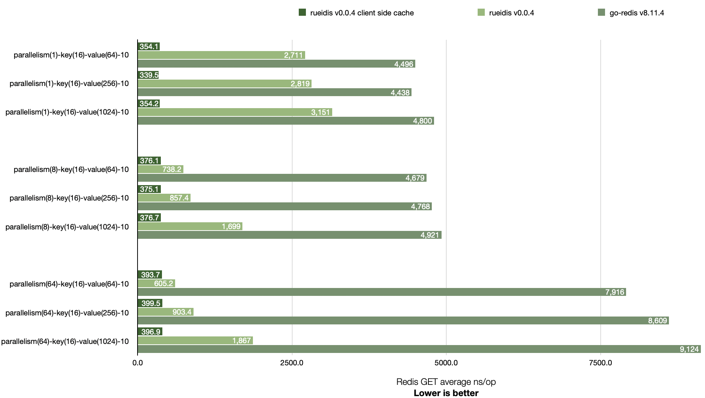
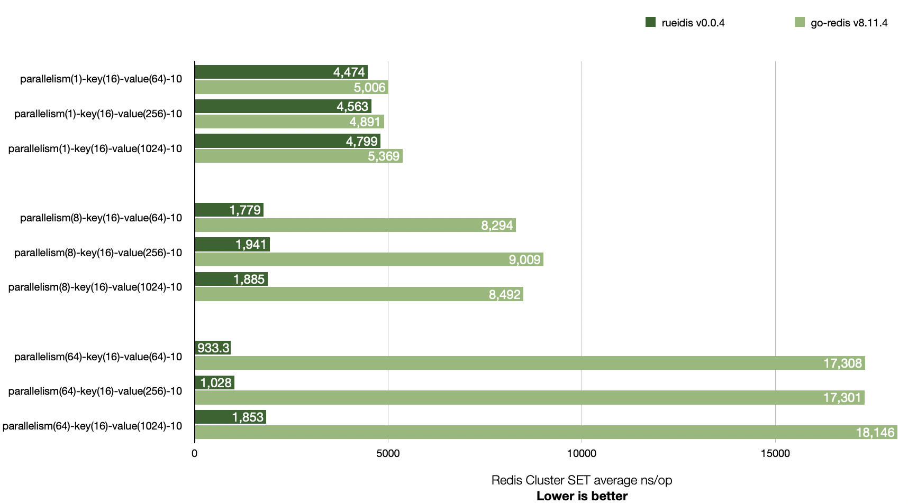

# Rueidis Benchmark

## Benchmark comparison with go-redis v8.11.4

Rueidis has higher throughput than go-redis v8.11.4 across 1, 8, and 64 parallelism settings.

It is even able to achieve ~14x throughput over go-redis in a local benchmark. (see `parallelism(64)-key(16)-value(64)-10`)

## Redis SET


```shell
# run redis-server 6.2.6 at 127.0.0.1:6379
▶ ./redis-server --save "" --appendonly no
▶ go test -bench=BenchmarkSingleClientSet -benchmem .
goos: darwin
goarch: arm64
pkg: rueidis-benchmark
BenchmarkSingleClientSet/Rueidis-parallelism(1)-key(16)-value(64)-10         	  392658	      2884 ns/op	     108 B/op	       3 allocs/op
BenchmarkSingleClientSet/GoRedis-parallelism(1)-key(16)-value(64)-10         	  258165	      4813 ns/op	     264 B/op	       7 allocs/op
BenchmarkSingleClientSet/Rueidis-parallelism(1)-key(16)-value(256)-10        	  386607	      3068 ns/op	     111 B/op	       4 allocs/op
BenchmarkSingleClientSet/GoRedis-parallelism(1)-key(16)-value(256)-10        	  261741	      4501 ns/op	     264 B/op	       7 allocs/op
BenchmarkSingleClientSet/Rueidis-parallelism(1)-key(16)-value(1024)-10       	  381343	      3034 ns/op	     112 B/op	       4 allocs/op
BenchmarkSingleClientSet/GoRedis-parallelism(1)-key(16)-value(1024)-10       	  240847	      4634 ns/op	     264 B/op	       7 allocs/op
BenchmarkSingleClientSet/Rueidis-parallelism(8)-key(16)-value(64)-10         	 1447234	       864.7 ns/op	     108 B/op	       3 allocs/op
BenchmarkSingleClientSet/GoRedis-parallelism(8)-key(16)-value(64)-10         	  230170	      5082 ns/op	     267 B/op	       7 allocs/op
BenchmarkSingleClientSet/Rueidis-parallelism(8)-key(16)-value(256)-10        	 1449660	       855.9 ns/op	     111 B/op	       4 allocs/op
BenchmarkSingleClientSet/GoRedis-parallelism(8)-key(16)-value(256)-10        	  264933	      4685 ns/op	     266 B/op	       7 allocs/op
BenchmarkSingleClientSet/Rueidis-parallelism(8)-key(16)-value(1024)-10       	  976764	      1065 ns/op	     112 B/op	       4 allocs/op
BenchmarkSingleClientSet/GoRedis-parallelism(8)-key(16)-value(1024)-10       	  257827	      4670 ns/op	     267 B/op	       7 allocs/op
BenchmarkSingleClientSet/Rueidis-parallelism(64)-key(16)-value(64)-10        	 1931443	       576.5 ns/op	     108 B/op	       3 allocs/op
BenchmarkSingleClientSet/GoRedis-parallelism(64)-key(16)-value(64)-10        	  139012	      8503 ns/op	     314 B/op	       7 allocs/op
BenchmarkSingleClientSet/Rueidis-parallelism(64)-key(16)-value(256)-10       	 1641424	       713.8 ns/op	     111 B/op	       4 allocs/op
BenchmarkSingleClientSet/GoRedis-parallelism(64)-key(16)-value(256)-10       	  132619	      8528 ns/op	     312 B/op	       7 allocs/op
BenchmarkSingleClientSet/Rueidis-parallelism(64)-key(16)-value(1024)-10      	  922458	      1190 ns/op	     112 B/op	       4 allocs/op
BenchmarkSingleClientSet/GoRedis-parallelism(64)-key(16)-value(1024)-10      	  140451	      8798 ns/op	     332 B/op	       7 allocs/op
PASS
ok  	rueidis-benchmark	29.588s
```

## Redis GET

Rueidis supports Redis 6 server-assisted client side caching. It is able to get more throughput if cache hit.



```shell
# run redis-server 6.2.6 at 127.0.0.1:6379
▶ ./redis-server --save "" --appendonly no
▶ go test -bench=BenchmarkSingleClientGet -benchmem .
goos: darwin
goarch: arm64
pkg: rueidis-benchmark
BenchmarkSingleClientGet/RueidisCSC-parallelism(1)-key(16)-value(64)-10         	 3297637	       354.1 ns/op	     104 B/op	       2 allocs/op
BenchmarkSingleClientGet/Rueidis-parallelism(1)-key(16)-value(64)-10            	  442717	      2711 ns/op	     168 B/op	       3 allocs/op
BenchmarkSingleClientGet/GoRedis-parallelism(1)-key(16)-value(64)-10            	  261824	      4496 ns/op	     276 B/op	       6 allocs/op
BenchmarkSingleClientGet/RueidisCSC-parallelism(1)-key(16)-value(256)-10        	 3339516	       339.5 ns/op	     104 B/op	       2 allocs/op
BenchmarkSingleClientGet/Rueidis-parallelism(1)-key(16)-value(256)-10           	  427974	      2819 ns/op	     360 B/op	       3 allocs/op
BenchmarkSingleClientGet/GoRedis-parallelism(1)-key(16)-value(256)-10           	  276176	      4438 ns/op	     484 B/op	       6 allocs/op
BenchmarkSingleClientGet/RueidisCSC-parallelism(1)-key(16)-value(1024)-10       	 3329212	       354.2 ns/op	     104 B/op	       2 allocs/op
BenchmarkSingleClientGet/Rueidis-parallelism(1)-key(16)-value(1024)-10          	  382720	      3151 ns/op	    1128 B/op	       3 allocs/op
BenchmarkSingleClientGet/GoRedis-parallelism(1)-key(16)-value(1024)-10          	  251404	      4800 ns/op	    1348 B/op	       6 allocs/op
BenchmarkSingleClientGet/RueidisCSC-parallelism(8)-key(16)-value(64)-10         	 3243331	       376.1 ns/op	     104 B/op	       2 allocs/op
BenchmarkSingleClientGet/Rueidis-parallelism(8)-key(16)-value(64)-10            	 1609714	       738.2 ns/op	     168 B/op	       3 allocs/op
BenchmarkSingleClientGet/GoRedis-parallelism(8)-key(16)-value(64)-10            	  273433	      4679 ns/op	     279 B/op	       6 allocs/op
BenchmarkSingleClientGet/RueidisCSC-parallelism(8)-key(16)-value(256)-10        	 3225018	       375.1 ns/op	     104 B/op	       2 allocs/op
BenchmarkSingleClientGet/Rueidis-parallelism(8)-key(16)-value(256)-10           	 1360250	       857.4 ns/op	     360 B/op	       3 allocs/op
BenchmarkSingleClientGet/GoRedis-parallelism(8)-key(16)-value(256)-10           	  278947	      4768 ns/op	     486 B/op	       6 allocs/op
BenchmarkSingleClientGet/RueidisCSC-parallelism(8)-key(16)-value(1024)-10       	 3200568	       376.7 ns/op	     104 B/op	       2 allocs/op
BenchmarkSingleClientGet/Rueidis-parallelism(8)-key(16)-value(1024)-10          	  669894	      1699 ns/op	    1129 B/op	       3 allocs/op
BenchmarkSingleClientGet/GoRedis-parallelism(8)-key(16)-value(1024)-10          	  208279	      4921 ns/op	    1352 B/op	       6 allocs/op
BenchmarkSingleClientGet/RueidisCSC-parallelism(64)-key(16)-value(64)-10        	 3031591	       393.7 ns/op	     104 B/op	       2 allocs/op
BenchmarkSingleClientGet/Rueidis-parallelism(64)-key(16)-value(64)-10           	 2001846	       605.2 ns/op	     168 B/op	       3 allocs/op
BenchmarkSingleClientGet/GoRedis-parallelism(64)-key(16)-value(64)-10           	  162163	      7916 ns/op	     317 B/op	       6 allocs/op
BenchmarkSingleClientGet/RueidisCSC-parallelism(64)-key(16)-value(256)-10       	 3065320	       399.5 ns/op	     104 B/op	       2 allocs/op
BenchmarkSingleClientGet/Rueidis-parallelism(64)-key(16)-value(256)-10          	 1310716	       903.4 ns/op	     360 B/op	       3 allocs/op
BenchmarkSingleClientGet/GoRedis-parallelism(64)-key(16)-value(256)-10          	  146584	      8609 ns/op	     534 B/op	       6 allocs/op
BenchmarkSingleClientGet/RueidisCSC-parallelism(64)-key(16)-value(1024)-10      	 3032733	       396.9 ns/op	     104 B/op	       2 allocs/op
BenchmarkSingleClientGet/Rueidis-parallelism(64)-key(16)-value(1024)-10         	  628176	      1867 ns/op	    1129 B/op	       3 allocs/op
BenchmarkSingleClientGet/GoRedis-parallelism(64)-key(16)-value(1024)-10         	  139076	      9124 ns/op	    1421 B/op	       6 allocs/op
PASS
ok  	rueidis-benchmark	46.749s
```

## Redis Cluster GET



```shell
▶ ./redis-server --port 7001 --save "" --appendonly no --cluster-enabled yes --cluster-config-file 7001.conf
▶ ./redis-server --port 7002 --save "" --appendonly no --cluster-enabled yes --cluster-config-file 7002.conf
▶ ./redis-server --port 7003 --save "" --appendonly no --cluster-enabled yes --cluster-config-file 7003.conf
▶ ./redis-cli --cluster create 127.0.0.1:7001 127.0.0.1:7002 127.0.0.1:7003 --cluster-yes
▶ go test -bench=BenchmarkClusterClientSet -benchmem -benchtime 2s .
goos: darwin
goarch: arm64
pkg: rueidis-benchmark
BenchmarkClusterClientSet/Rueidis-parallelism(1)-key(16)-value(64)-10         	  494546	      4474 ns/op	     112 B/op	       3 allocs/op
BenchmarkClusterClientSet/GoRedis-parallelism(1)-key(16)-value(64)-10         	  496608	      5006 ns/op	     264 B/op	       7 allocs/op
BenchmarkClusterClientSet/Rueidis-parallelism(1)-key(16)-value(256)-10        	  487437	      4563 ns/op	     115 B/op	       4 allocs/op
BenchmarkClusterClientSet/GoRedis-parallelism(1)-key(16)-value(256)-10        	  479134	      4891 ns/op	     264 B/op	       7 allocs/op
BenchmarkClusterClientSet/Rueidis-parallelism(1)-key(16)-value(1024)-10       	  440024	      4799 ns/op	     116 B/op	       4 allocs/op
BenchmarkClusterClientSet/GoRedis-parallelism(1)-key(16)-value(1024)-10       	  457611	      5369 ns/op	     264 B/op	       7 allocs/op
BenchmarkClusterClientSet/Rueidis-parallelism(8)-key(16)-value(64)-10         	 1290128	      1779 ns/op	     109 B/op	       3 allocs/op
BenchmarkClusterClientSet/GoRedis-parallelism(8)-key(16)-value(64)-10         	  328870	      8294 ns/op	     271 B/op	       7 allocs/op
BenchmarkClusterClientSet/Rueidis-parallelism(8)-key(16)-value(256)-10        	 1209879	      1941 ns/op	     113 B/op	       4 allocs/op
BenchmarkClusterClientSet/GoRedis-parallelism(8)-key(16)-value(256)-10        	  373011	      9009 ns/op	     270 B/op	       7 allocs/op
BenchmarkClusterClientSet/Rueidis-parallelism(8)-key(16)-value(1024)-10       	 1247076	      1885 ns/op	     113 B/op	       4 allocs/op
BenchmarkClusterClientSet/GoRedis-parallelism(8)-key(16)-value(1024)-10       	  258309	      8492 ns/op	     273 B/op	       7 allocs/op
BenchmarkClusterClientSet/Rueidis-parallelism(64)-key(16)-value(64)-10        	 2593460	       933.3 ns/op	     108 B/op	       3 allocs/op
BenchmarkClusterClientSet/GoRedis-parallelism(64)-key(16)-value(64)-10        	  321098	     17308 ns/op	     314 B/op	       7 allocs/op
BenchmarkClusterClientSet/Rueidis-parallelism(64)-key(16)-value(256)-10       	 2109002	      1028 ns/op	     112 B/op	       4 allocs/op
BenchmarkClusterClientSet/GoRedis-parallelism(64)-key(16)-value(256)-10       	  259333	     17301 ns/op	     319 B/op	       7 allocs/op
BenchmarkClusterClientSet/Rueidis-parallelism(64)-key(16)-value(1024)-10      	 1384227	      1853 ns/op	     112 B/op	       4 allocs/op
BenchmarkClusterClientSet/GoRedis-parallelism(64)-key(16)-value(1024)-10      	  273987	     18146 ns/op	     321 B/op	       7 allocs/op
PASS
ok  	rueidis-benchmark	70.166s
```

