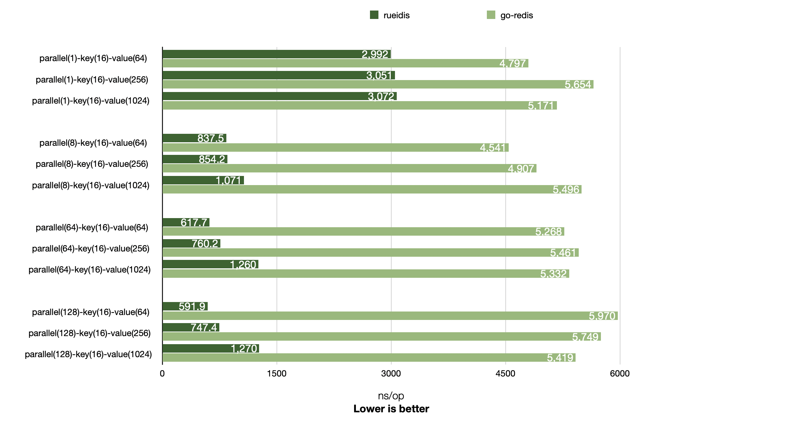

# Rueidis Benchmark

## Benchmark comparison with go-redis v8.11.4

Rueidis has higher throughput than go-redis v8.11.4 across 1, 8, 64, and 128 parallelism settings.

In some case, it is even able to achieve ~10x throughput over go-redis in a local benchmark. (RueidisSet-parallel(128)-key(16)-value(64)-10)



```shell
# run redis-server 6.2.6 at 127.0.0.1:6379
▶ ./redis-server
▶ go test -bench=. -benchmem .
goos: darwin
goarch: arm64
pkg: rueidis-benchmark
BenchmarkSingleClient/RueidisSet-parallel(1)-key(16)-value(64)-10         	  396998	      2992 ns/op	     108 B/op	       3 allocs/op
BenchmarkSingleClient/GoRedisSet-parallel(1)-key(16)-value(64)-10         	  219867	      4797 ns/op	     264 B/op	       7 allocs/op
BenchmarkSingleClient/RueidisSet-parallel(1)-key(16)-value(256)-10        	  368961	      3051 ns/op	     111 B/op	       4 allocs/op
BenchmarkSingleClient/GoRedisSet-parallel(1)-key(16)-value(256)-10        	  238548	      5654 ns/op	     264 B/op	       7 allocs/op
BenchmarkSingleClient/RueidisSet-parallel(1)-key(16)-value(1024)-10       	  363894	      3072 ns/op	     112 B/op	       4 allocs/op
BenchmarkSingleClient/GoRedisSet-parallel(1)-key(16)-value(1024)-10       	  221748	      5171 ns/op	     264 B/op	       7 allocs/op
BenchmarkSingleClient/RueidisSet-parallel(8)-key(16)-value(64)-10         	 1423162	       837.5 ns/op	     108 B/op	       3 allocs/op
BenchmarkSingleClient/GoRedisSet-parallel(8)-key(16)-value(64)-10         	  225992	      4541 ns/op	     267 B/op	       7 allocs/op
BenchmarkSingleClient/RueidisSet-parallel(8)-key(16)-value(256)-10        	 1370198	       854.2 ns/op	     111 B/op	       4 allocs/op
BenchmarkSingleClient/GoRedisSet-parallel(8)-key(16)-value(256)-10        	  247543	      4907 ns/op	     267 B/op	       7 allocs/op
BenchmarkSingleClient/RueidisSet-parallel(8)-key(16)-value(1024)-10       	 1023876	      1071 ns/op	     112 B/op	       4 allocs/op
BenchmarkSingleClient/GoRedisSet-parallel(8)-key(16)-value(1024)-10       	  234331	      5496 ns/op	     267 B/op	       7 allocs/op
BenchmarkSingleClient/RueidisSet-parallel(64)-key(16)-value(64)-10        	 2012234	       617.7 ns/op	     108 B/op	       3 allocs/op
BenchmarkSingleClient/GoRedisSet-parallel(64)-key(16)-value(64)-10        	  224475	      5268 ns/op	     271 B/op	       7 allocs/op
BenchmarkSingleClient/RueidisSet-parallel(64)-key(16)-value(256)-10       	 1587568	       760.2 ns/op	     111 B/op	       4 allocs/op
BenchmarkSingleClient/GoRedisSet-parallel(64)-key(16)-value(256)-10       	  209152	      5461 ns/op	     271 B/op	       7 allocs/op
BenchmarkSingleClient/RueidisSet-parallel(64)-key(16)-value(1024)-10      	  947715	      1260 ns/op	     112 B/op	       4 allocs/op
BenchmarkSingleClient/GoRedisSet-parallel(64)-key(16)-value(1024)-10      	  226498	      5332 ns/op	     270 B/op	       7 allocs/op
BenchmarkSingleClient/RueidisSet-parallel(128)-key(16)-value(64)-10       	 1897695	       591.9 ns/op	     108 B/op	       3 allocs/op
BenchmarkSingleClient/GoRedisSet-parallel(128)-key(16)-value(64)-10       	  215678	      5970 ns/op	     271 B/op	       7 allocs/op
BenchmarkSingleClient/RueidisSet-parallel(128)-key(16)-value(256)-10      	 1568532	       747.4 ns/op	     111 B/op	       4 allocs/op
BenchmarkSingleClient/GoRedisSet-parallel(128)-key(16)-value(256)-10      	  216358	      5749 ns/op	     271 B/op	       7 allocs/op
BenchmarkSingleClient/RueidisSet-parallel(128)-key(16)-value(1024)-10     	  916250	      1270 ns/op	     112 B/op	       4 allocs/op
BenchmarkSingleClient/GoRedisSet-parallel(128)-key(16)-value(1024)-10     	  206382	      5419 ns/op	     272 B/op	       7 allocs/op
PASS
ok  	rueidis-benchmark	37.526s
```