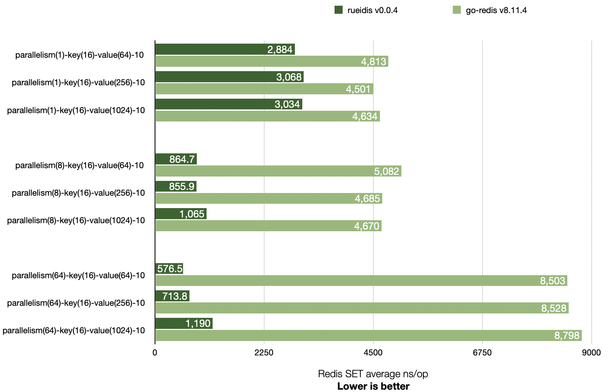

# Rueidis Benchmark

## Benchmark comparison with go-redis v8.11.4

Rueidis has higher throughput than go-redis v8.11.4 across 1, 8, and 64 parallelism settings.

It is even able to achieve ~14x throughput over go-redis in a local benchmark. (see `parallelism(64)-key(16)-value(64)-10`)



```shell
# run redis-server 6.2.6 at 127.0.0.1:6379
▶ ./redis-server
▶ go test -bench=BenchmarkSingleClient -benchmem .
goos: darwin
goarch: arm64
pkg: rueidis-benchmark
BenchmarkSingleClient/RueidisSet-parallelism(1)-key(16)-value(64)-10         	  392658	      2884 ns/op	     108 B/op	       3 allocs/op
BenchmarkSingleClient/GoRedisSet-parallelism(1)-key(16)-value(64)-10         	  258165	      4813 ns/op	     264 B/op	       7 allocs/op
BenchmarkSingleClient/RueidisSet-parallelism(1)-key(16)-value(256)-10        	  386607	      3068 ns/op	     111 B/op	       4 allocs/op
BenchmarkSingleClient/GoRedisSet-parallelism(1)-key(16)-value(256)-10        	  261741	      4501 ns/op	     264 B/op	       7 allocs/op
BenchmarkSingleClient/RueidisSet-parallelism(1)-key(16)-value(1024)-10       	  381343	      3034 ns/op	     112 B/op	       4 allocs/op
BenchmarkSingleClient/GoRedisSet-parallelism(1)-key(16)-value(1024)-10       	  240847	      4634 ns/op	     264 B/op	       7 allocs/op
BenchmarkSingleClient/RueidisSet-parallelism(8)-key(16)-value(64)-10         	 1447234	       864.7 ns/op	     108 B/op	       3 allocs/op
BenchmarkSingleClient/GoRedisSet-parallelism(8)-key(16)-value(64)-10         	  230170	      5082 ns/op	     267 B/op	       7 allocs/op
BenchmarkSingleClient/RueidisSet-parallelism(8)-key(16)-value(256)-10        	 1449660	       855.9 ns/op	     111 B/op	       4 allocs/op
BenchmarkSingleClient/GoRedisSet-parallelism(8)-key(16)-value(256)-10        	  264933	      4685 ns/op	     266 B/op	       7 allocs/op
BenchmarkSingleClient/RueidisSet-parallelism(8)-key(16)-value(1024)-10       	  976764	      1065 ns/op	     112 B/op	       4 allocs/op
BenchmarkSingleClient/GoRedisSet-parallelism(8)-key(16)-value(1024)-10       	  257827	      4670 ns/op	     267 B/op	       7 allocs/op
BenchmarkSingleClient/RueidisSet-parallelism(64)-key(16)-value(64)-10        	 1931443	       576.5 ns/op	     108 B/op	       3 allocs/op
BenchmarkSingleClient/GoRedisSet-parallelism(64)-key(16)-value(64)-10        	  139012	      8503 ns/op	     314 B/op	       7 allocs/op
BenchmarkSingleClient/RueidisSet-parallelism(64)-key(16)-value(256)-10       	 1641424	       713.8 ns/op	     111 B/op	       4 allocs/op
BenchmarkSingleClient/GoRedisSet-parallelism(64)-key(16)-value(256)-10       	  132619	      8528 ns/op	     312 B/op	       7 allocs/op
BenchmarkSingleClient/RueidisSet-parallelism(64)-key(16)-value(1024)-10      	  922458	      1190 ns/op	     112 B/op	       4 allocs/op
BenchmarkSingleClient/GoRedisSet-parallelism(64)-key(16)-value(1024)-10      	  140451	      8798 ns/op	     332 B/op	       7 allocs/op
PASS
ok  	rueidis-benchmark	29.588s
```