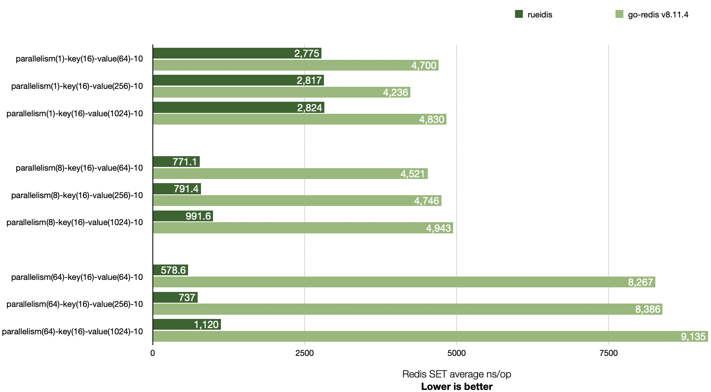
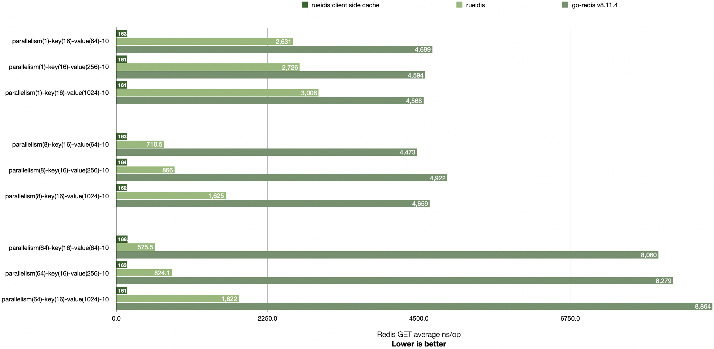

# Rueidis Benchmark

## Benchmark comparison with go-redis v8.11.4

Rueidis has higher throughput than go-redis v8.11.4 across 1, 8, and 64 parallelism settings.

It is even able to achieve ~14x throughput over go-redis in a local benchmark. (see `parallelism(64)-key(16)-value(64)-10`)

## Redis SET



```shell
# run redis-server 6.2.6 at 127.0.0.1:6379
▶ ./redis-server --save "" --appendonly no
▶ go test -bench=BenchmarkSingleClientSet -benchmem -benchtime 2s .
goos: darwin
goarch: arm64
pkg: rueidis-benchmark
BenchmarkSingleClientSet/Rueidis-parallelism(1)-key(16)-value(64)-10         	  855358	      2775 ns/op	      84 B/op	       2 allocs/op
BenchmarkSingleClientSet/GoRedis-parallelism(1)-key(16)-value(64)-10         	  508824	      4700 ns/op	     264 B/op	       7 allocs/op
BenchmarkSingleClientSet/Rueidis-parallelism(1)-key(16)-value(256)-10        	  851986	      2817 ns/op	      87 B/op	       3 allocs/op
BenchmarkSingleClientSet/GoRedis-parallelism(1)-key(16)-value(256)-10        	  477892	      4236 ns/op	     264 B/op	       7 allocs/op
BenchmarkSingleClientSet/Rueidis-parallelism(1)-key(16)-value(1024)-10       	  766586	      2824 ns/op	      88 B/op	       3 allocs/op
BenchmarkSingleClientSet/GoRedis-parallelism(1)-key(16)-value(1024)-10       	  493504	      4830 ns/op	     264 B/op	       7 allocs/op
BenchmarkSingleClientSet/Rueidis-parallelism(8)-key(16)-value(64)-10         	 3086222	       771.1 ns/op	      84 B/op	       2 allocs/op
BenchmarkSingleClientSet/GoRedis-parallelism(8)-key(16)-value(64)-10         	  477692	      4521 ns/op	     265 B/op	       7 allocs/op
BenchmarkSingleClientSet/Rueidis-parallelism(8)-key(16)-value(256)-10        	 2945299	       791.4 ns/op	      87 B/op	       3 allocs/op
BenchmarkSingleClientSet/GoRedis-parallelism(8)-key(16)-value(256)-10        	  466651	      4746 ns/op	     265 B/op	       7 allocs/op
BenchmarkSingleClientSet/Rueidis-parallelism(8)-key(16)-value(1024)-10       	 2480588	       991.6 ns/op	      88 B/op	       3 allocs/op
BenchmarkSingleClientSet/GoRedis-parallelism(8)-key(16)-value(1024)-10       	  471200	      4943 ns/op	     265 B/op	       7 allocs/op
BenchmarkSingleClientSet/Rueidis-parallelism(64)-key(16)-value(64)-10        	 4066245	       578.6 ns/op	      84 B/op	       2 allocs/op
BenchmarkSingleClientSet/GoRedis-parallelism(64)-key(16)-value(64)-10        	  312630	      8267 ns/op	     284 B/op	       7 allocs/op
BenchmarkSingleClientSet/Rueidis-parallelism(64)-key(16)-value(256)-10       	 3466827	       737.0 ns/op	      87 B/op	       3 allocs/op
BenchmarkSingleClientSet/GoRedis-parallelism(64)-key(16)-value(256)-10       	  351931	      8386 ns/op	     283 B/op	       7 allocs/op
BenchmarkSingleClientSet/Rueidis-parallelism(64)-key(16)-value(1024)-10      	 2226771	      1120 ns/op	      88 B/op	       3 allocs/op
BenchmarkSingleClientSet/GoRedis-parallelism(64)-key(16)-value(1024)-10      	  286224	      9135 ns/op	     288 B/op	       7 allocs/op
PASS
ok  	rueidis-benchmark	57.018s
```

## Redis GET

Rueidis supports Redis 6 server-assisted client side caching. It is able to get more throughput if cache hit.



```shell
# run redis-server 6.2.6 at 127.0.0.1:6379
▶ ./redis-server --save "" --appendonly no
▶ go test -bench=BenchmarkSingleClientGet -benchmem -benchtime 2s .
goos: darwin
goarch: arm64
pkg: rueidis-benchmark
BenchmarkSingleClientGet/RueidisCSC-parallelism(1)-key(16)-value(64)-10         	14773192	       163.0 ns/op	      80 B/op	       1 allocs/op
BenchmarkSingleClientGet/Rueidis-parallelism(1)-key(16)-value(64)-10            	  909559	      2631 ns/op	     144 B/op	       2 allocs/op
BenchmarkSingleClientGet/GoRedis-parallelism(1)-key(16)-value(64)-10            	  550330	      4699 ns/op	     276 B/op	       6 allocs/op
BenchmarkSingleClientGet/RueidisCSC-parallelism(1)-key(16)-value(256)-10        	14891766	       161.2 ns/op	      80 B/op	       1 allocs/op
BenchmarkSingleClientGet/Rueidis-parallelism(1)-key(16)-value(256)-10           	  878718	      2726 ns/op	     336 B/op	       2 allocs/op
BenchmarkSingleClientGet/GoRedis-parallelism(1)-key(16)-value(256)-10           	  524229	      4594 ns/op	     484 B/op	       6 allocs/op
BenchmarkSingleClientGet/RueidisCSC-parallelism(1)-key(16)-value(1024)-10       	14911257	       161.0 ns/op	      80 B/op	       1 allocs/op
BenchmarkSingleClientGet/Rueidis-parallelism(1)-key(16)-value(1024)-10          	  793944	      3008 ns/op	    1104 B/op	       2 allocs/op
BenchmarkSingleClientGet/GoRedis-parallelism(1)-key(16)-value(1024)-10          	  484776	      4568 ns/op	    1348 B/op	       6 allocs/op
BenchmarkSingleClientGet/RueidisCSC-parallelism(8)-key(16)-value(64)-10         	14723206	       163.2 ns/op	      80 B/op	       1 allocs/op
BenchmarkSingleClientGet/Rueidis-parallelism(8)-key(16)-value(64)-10            	 3337192	       710.5 ns/op	     144 B/op	       2 allocs/op
BenchmarkSingleClientGet/GoRedis-parallelism(8)-key(16)-value(64)-10            	  549067	      4473 ns/op	     277 B/op	       6 allocs/op
BenchmarkSingleClientGet/RueidisCSC-parallelism(8)-key(16)-value(256)-10        	14969062	       164.1 ns/op	      80 B/op	       1 allocs/op
BenchmarkSingleClientGet/Rueidis-parallelism(8)-key(16)-value(256)-10           	 2831607	       866.0 ns/op	     336 B/op	       2 allocs/op
BenchmarkSingleClientGet/GoRedis-parallelism(8)-key(16)-value(256)-10           	  499524	      4922 ns/op	     485 B/op	       6 allocs/op
BenchmarkSingleClientGet/RueidisCSC-parallelism(8)-key(16)-value(1024)-10       	14906901	       162.7 ns/op	      80 B/op	       1 allocs/op
BenchmarkSingleClientGet/Rueidis-parallelism(8)-key(16)-value(1024)-10          	 1435716	      1625 ns/op	    1105 B/op	       2 allocs/op
BenchmarkSingleClientGet/GoRedis-parallelism(8)-key(16)-value(1024)-10          	  469586	      4659 ns/op	    1350 B/op	       6 allocs/op
BenchmarkSingleClientGet/RueidisCSC-parallelism(64)-key(16)-value(64)-10        	14743629	       166.3 ns/op	      80 B/op	       1 allocs/op
BenchmarkSingleClientGet/Rueidis-parallelism(64)-key(16)-value(64)-10           	 4184803	       575.5 ns/op	     144 B/op	       2 allocs/op
BenchmarkSingleClientGet/GoRedis-parallelism(64)-key(16)-value(64)-10           	  252055	      8060 ns/op	     303 B/op	       6 allocs/op
BenchmarkSingleClientGet/RueidisCSC-parallelism(64)-key(16)-value(256)-10       	14841229	       163.0 ns/op	      80 B/op	       1 allocs/op
BenchmarkSingleClientGet/Rueidis-parallelism(64)-key(16)-value(256)-10          	 2811589	       824.1 ns/op	     337 B/op	       2 allocs/op
BenchmarkSingleClientGet/GoRedis-parallelism(64)-key(16)-value(256)-10          	  279134	      8279 ns/op	     506 B/op	       6 allocs/op
BenchmarkSingleClientGet/RueidisCSC-parallelism(64)-key(16)-value(1024)-10      	14452345	       161.7 ns/op	      80 B/op	       1 allocs/op
BenchmarkSingleClientGet/Rueidis-parallelism(64)-key(16)-value(1024)-10         	 1287498	      1822 ns/op	    1106 B/op	       2 allocs/op
BenchmarkSingleClientGet/GoRedis-parallelism(64)-key(16)-value(1024)-10         	  271814	      8864 ns/op	    1371 B/op	       6 allocs/op
PASS
ok  	rueidis-benchmark	84.624s
```

## Redis Cluster GET


```shell
▶ ./redis-server --port 7001 --save "" --appendonly no --cluster-enabled yes --cluster-config-file 7001.conf
▶ ./redis-server --port 7002 --save "" --appendonly no --cluster-enabled yes --cluster-config-file 7002.conf
▶ ./redis-server --port 7003 --save "" --appendonly no --cluster-enabled yes --cluster-config-file 7003.conf
▶ ./redis-cli --cluster create 127.0.0.1:7001 127.0.0.1:7002 127.0.0.1:7003 --cluster-yes
▶ go test -bench=BenchmarkClusterClientSet -benchmem -benchtime 2s .
goos: darwin
goarch: arm64
pkg: rueidis-benchmark
BenchmarkClusterClientSet/Rueidis-parallelism(4)-key(16)-value(64)-10         	 1159168	      2061 ns/op	      85 B/op	       2 allocs/op
BenchmarkClusterClientSet/GoRedis-parallelism(4)-key(16)-value(64)-10         	  554112	      5053 ns/op	     266 B/op	       7 allocs/op
BenchmarkClusterClientSet/Rueidis-parallelism(4)-key(16)-value(256)-10        	 1257273	      2000 ns/op	      88 B/op	       3 allocs/op
BenchmarkClusterClientSet/GoRedis-parallelism(4)-key(16)-value(256)-10        	  480345	      4804 ns/op	     266 B/op	       7 allocs/op
BenchmarkClusterClientSet/Rueidis-parallelism(4)-key(16)-value(1024)-10       	 1016780	      2189 ns/op	      90 B/op	       3 allocs/op
BenchmarkClusterClientSet/GoRedis-parallelism(4)-key(16)-value(1024)-10       	  518439	      5341 ns/op	     266 B/op	       7 allocs/op
BenchmarkClusterClientSet/Rueidis-parallelism(16)-key(16)-value(64)-10        	 1850829	      1352 ns/op	      84 B/op	       2 allocs/op
BenchmarkClusterClientSet/GoRedis-parallelism(16)-key(16)-value(64)-10        	  264522	     12578 ns/op	     282 B/op	       7 allocs/op
BenchmarkClusterClientSet/Rueidis-parallelism(16)-key(16)-value(256)-10       	 1577730	      1427 ns/op	      88 B/op	       3 allocs/op
BenchmarkClusterClientSet/GoRedis-parallelism(16)-key(16)-value(256)-10       	  218065	     13201 ns/op	     285 B/op	       7 allocs/op
BenchmarkClusterClientSet/Rueidis-parallelism(16)-key(16)-value(1024)-10      	 1298611	      1689 ns/op	      89 B/op	       3 allocs/op
BenchmarkClusterClientSet/GoRedis-parallelism(16)-key(16)-value(1024)-10      	  292071	     13638 ns/op	     279 B/op	       7 allocs/op
BenchmarkClusterClientSet/Rueidis-parallelism(96)-key(16)-value(64)-10        	 2794567	       742.2 ns/op	      84 B/op	       2 allocs/op
BenchmarkClusterClientSet/GoRedis-parallelism(96)-key(16)-value(64)-10        	  273148	     18706 ns/op	     338 B/op	       7 allocs/op
BenchmarkClusterClientSet/Rueidis-parallelism(96)-key(16)-value(256)-10       	 3022731	       849.2 ns/op	      87 B/op	       3 allocs/op
BenchmarkClusterClientSet/GoRedis-parallelism(96)-key(16)-value(256)-10       	  241704	     18827 ns/op	     347 B/op	       7 allocs/op
BenchmarkClusterClientSet/Rueidis-parallelism(96)-key(16)-value(1024)-10      	 1531574	      1561 ns/op	      89 B/op	       3 allocs/op
BenchmarkClusterClientSet/GoRedis-parallelism(96)-key(16)-value(1024)-10      	  196857	     18017 ns/op	     359 B/op	       7 allocs/op
PASS
ok  	rueidis-benchmark	75.067s
```

