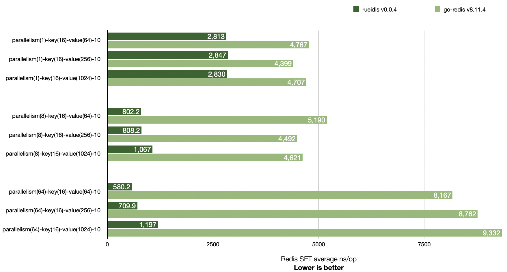
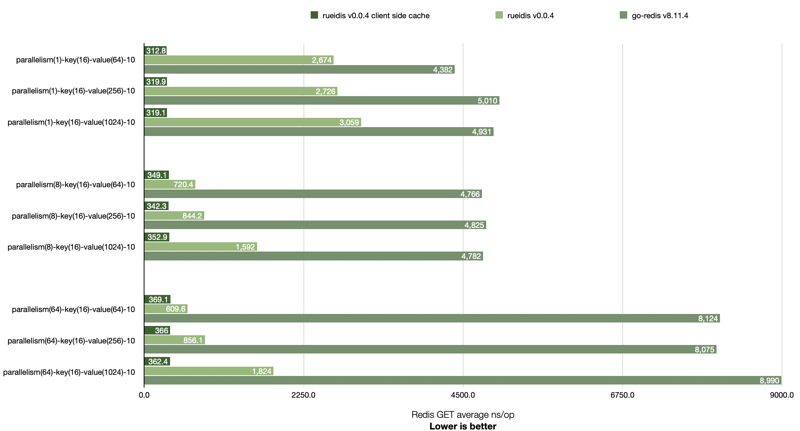
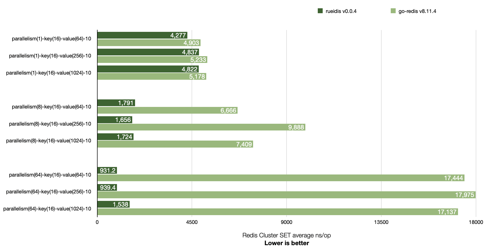

# Rueidis Benchmark

## Benchmark comparison with go-redis v8.11.4

Rueidis has higher throughput than go-redis v8.11.4 across 1, 8, and 64 parallelism settings.

It is even able to achieve ~14x throughput over go-redis in a local benchmark. (see `parallelism(64)-key(16)-value(64)-10`)

## Redis SET



```shell
# run redis-server 6.2.6 at 127.0.0.1:6379
▶ ./redis-server --save "" --appendonly no
▶ go test -bench=BenchmarkSingleClientSet -benchmem -benchtime 2s .
goos: darwin
goarch: arm64
pkg: rueidis-benchmark
BenchmarkSingleClientSet/Rueidis-parallelism(1)-key(16)-value(64)-10         	  851725	      2813 ns/op	      84 B/op	       2 allocs/op
BenchmarkSingleClientSet/GoRedis-parallelism(1)-key(16)-value(64)-10         	  525267	      4767 ns/op	     264 B/op	       7 allocs/op
BenchmarkSingleClientSet/Rueidis-parallelism(1)-key(16)-value(256)-10        	  790644	      2847 ns/op	      87 B/op	       3 allocs/op
BenchmarkSingleClientSet/GoRedis-parallelism(1)-key(16)-value(256)-10        	  468105	      4399 ns/op	     264 B/op	       7 allocs/op
BenchmarkSingleClientSet/Rueidis-parallelism(1)-key(16)-value(1024)-10       	  844472	      2830 ns/op	      88 B/op	       3 allocs/op
BenchmarkSingleClientSet/GoRedis-parallelism(1)-key(16)-value(1024)-10       	  497860	      4707 ns/op	     264 B/op	       7 allocs/op
BenchmarkSingleClientSet/Rueidis-parallelism(8)-key(16)-value(64)-10         	 2790153	       802.2 ns/op	      84 B/op	       2 allocs/op
BenchmarkSingleClientSet/GoRedis-parallelism(8)-key(16)-value(64)-10         	  478107	      5190 ns/op	     265 B/op	       7 allocs/op
BenchmarkSingleClientSet/Rueidis-parallelism(8)-key(16)-value(256)-10        	 2957210	       808.2 ns/op	      87 B/op	       3 allocs/op
BenchmarkSingleClientSet/GoRedis-parallelism(8)-key(16)-value(256)-10        	  551965	      4492 ns/op	     265 B/op	       7 allocs/op
BenchmarkSingleClientSet/Rueidis-parallelism(8)-key(16)-value(1024)-10       	 2204311	      1067 ns/op	      88 B/op	       3 allocs/op
BenchmarkSingleClientSet/GoRedis-parallelism(8)-key(16)-value(1024)-10       	  443406	      4621 ns/op	     265 B/op	       7 allocs/op
BenchmarkSingleClientSet/Rueidis-parallelism(64)-key(16)-value(64)-10        	 4212328	       580.2 ns/op	      84 B/op	       2 allocs/op
BenchmarkSingleClientSet/GoRedis-parallelism(64)-key(16)-value(64)-10        	  276800	      8167 ns/op	     302 B/op	       7 allocs/op
BenchmarkSingleClientSet/Rueidis-parallelism(64)-key(16)-value(256)-10       	 3386228	       709.9 ns/op	      87 B/op	       3 allocs/op
BenchmarkSingleClientSet/GoRedis-parallelism(64)-key(16)-value(256)-10       	  266737	      8762 ns/op	     296 B/op	       7 allocs/op
BenchmarkSingleClientSet/Rueidis-parallelism(64)-key(16)-value(1024)-10      	 2044932	      1197 ns/op	      88 B/op	       3 allocs/op
BenchmarkSingleClientSet/GoRedis-parallelism(64)-key(16)-value(1024)-10      	  214808	      9332 ns/op	     301 B/op	       7 allocs/op
PASS
ok  	rueidis-benchmark	57.018s
```

## Redis GET

Rueidis supports Redis 6 server-assisted client side caching. It is able to get more throughput if cache hit.



```shell
# run redis-server 6.2.6 at 127.0.0.1:6379
▶ ./redis-server --save "" --appendonly no
▶ go test -bench=BenchmarkSingleClientGet -benchmem -benchtime 2s .
goos: darwin
goarch: arm64
pkg: rueidis-benchmark
BenchmarkSingleClientGet/RueidisCSC-parallelism(1)-key(16)-value(64)-10         	 7399795	       312.8 ns/op	      80 B/op	       1 allocs/op
BenchmarkSingleClientGet/Rueidis-parallelism(1)-key(16)-value(64)-10            	  901117	      2674 ns/op	     144 B/op	       2 allocs/op
BenchmarkSingleClientGet/GoRedis-parallelism(1)-key(16)-value(64)-10            	  554689	      4382 ns/op	     276 B/op	       6 allocs/op
BenchmarkSingleClientGet/RueidisCSC-parallelism(1)-key(16)-value(256)-10        	 7477524	       319.9 ns/op	      80 B/op	       1 allocs/op
BenchmarkSingleClientGet/Rueidis-parallelism(1)-key(16)-value(256)-10           	  875290	      2726 ns/op	     336 B/op	       2 allocs/op
BenchmarkSingleClientGet/GoRedis-parallelism(1)-key(16)-value(256)-10           	  484314	      5010 ns/op	     484 B/op	       6 allocs/op
BenchmarkSingleClientGet/RueidisCSC-parallelism(1)-key(16)-value(1024)-10       	 7687102	       319.1 ns/op	      80 B/op	       1 allocs/op
BenchmarkSingleClientGet/Rueidis-parallelism(1)-key(16)-value(1024)-10          	  785148	      3059 ns/op	    1104 B/op	       2 allocs/op
BenchmarkSingleClientGet/GoRedis-parallelism(1)-key(16)-value(1024)-10          	  501626	      4931 ns/op	    1348 B/op	       6 allocs/op
BenchmarkSingleClientGet/RueidisCSC-parallelism(8)-key(16)-value(64)-10         	 7008738	       349.1 ns/op	      80 B/op	       1 allocs/op
BenchmarkSingleClientGet/Rueidis-parallelism(8)-key(16)-value(64)-10            	 3271624	       720.4 ns/op	     144 B/op	       2 allocs/op
BenchmarkSingleClientGet/GoRedis-parallelism(8)-key(16)-value(64)-10            	  499347	      4766 ns/op	     277 B/op	       6 allocs/op
BenchmarkSingleClientGet/RueidisCSC-parallelism(8)-key(16)-value(256)-10        	 7058433	       342.3 ns/op	      80 B/op	       1 allocs/op
BenchmarkSingleClientGet/Rueidis-parallelism(8)-key(16)-value(256)-10           	 2786624	       844.2 ns/op	     336 B/op	       2 allocs/op
BenchmarkSingleClientGet/GoRedis-parallelism(8)-key(16)-value(256)-10           	  498802	      4825 ns/op	     485 B/op	       6 allocs/op
BenchmarkSingleClientGet/RueidisCSC-parallelism(8)-key(16)-value(1024)-10       	 7020951	       352.9 ns/op	      80 B/op	       1 allocs/op
BenchmarkSingleClientGet/Rueidis-parallelism(8)-key(16)-value(1024)-10          	 1543508	      1592 ns/op	    1105 B/op	       2 allocs/op
BenchmarkSingleClientGet/GoRedis-parallelism(8)-key(16)-value(1024)-10          	  494362	      4782 ns/op	    1349 B/op	       6 allocs/op
BenchmarkSingleClientGet/RueidisCSC-parallelism(64)-key(16)-value(64)-10        	 6610756	       369.1 ns/op	      80 B/op	       1 allocs/op
BenchmarkSingleClientGet/Rueidis-parallelism(64)-key(16)-value(64)-10           	 3945650	       609.6 ns/op	     144 B/op	       2 allocs/op
BenchmarkSingleClientGet/GoRedis-parallelism(64)-key(16)-value(64)-10           	  286483	      8124 ns/op	     316 B/op	       6 allocs/op
BenchmarkSingleClientGet/RueidisCSC-parallelism(64)-key(16)-value(256)-10       	 6717535	       366.0 ns/op	      80 B/op	       1 allocs/op
BenchmarkSingleClientGet/Rueidis-parallelism(64)-key(16)-value(256)-10          	 2668569	       856.1 ns/op	     337 B/op	       2 allocs/op
BenchmarkSingleClientGet/GoRedis-parallelism(64)-key(16)-value(256)-10          	  255148	      8075 ns/op	     524 B/op	       6 allocs/op
BenchmarkSingleClientGet/RueidisCSC-parallelism(64)-key(16)-value(1024)-10      	 6730621	       362.4 ns/op	      80 B/op	       1 allocs/op
BenchmarkSingleClientGet/Rueidis-parallelism(64)-key(16)-value(1024)-10         	 1326595	      1824 ns/op	    1106 B/op	       2 allocs/op
BenchmarkSingleClientGet/GoRedis-parallelism(64)-key(16)-value(1024)-10         	  274255	      8990 ns/op	    1381 B/op	       6 allocs/op
PASS
ok  	rueidis-benchmark	84.624s
```

## Redis Cluster GET



```shell
▶ ./redis-server --port 7001 --save "" --appendonly no --cluster-enabled yes --cluster-config-file 7001.conf
▶ ./redis-server --port 7002 --save "" --appendonly no --cluster-enabled yes --cluster-config-file 7002.conf
▶ ./redis-server --port 7003 --save "" --appendonly no --cluster-enabled yes --cluster-config-file 7003.conf
▶ ./redis-cli --cluster create 127.0.0.1:7001 127.0.0.1:7002 127.0.0.1:7003 --cluster-yes
▶ go test -bench=BenchmarkClusterClientSet -benchmem -benchtime 2s .
goos: darwin
goarch: arm64
pkg: rueidis-benchmark
BenchmarkClusterClientSet/Rueidis-parallelism(1)-key(16)-value(64)-10         	  547725	      4277 ns/op	      85 B/op	       2 allocs/op
BenchmarkClusterClientSet/GoRedis-parallelism(1)-key(16)-value(64)-10         	  475351	      4903 ns/op	     264 B/op	       7 allocs/op
BenchmarkClusterClientSet/Rueidis-parallelism(1)-key(16)-value(256)-10        	  481542	      4837 ns/op	      91 B/op	       3 allocs/op
BenchmarkClusterClientSet/GoRedis-parallelism(1)-key(16)-value(256)-10        	  491341	      5233 ns/op	     264 B/op	       7 allocs/op
BenchmarkClusterClientSet/Rueidis-parallelism(1)-key(16)-value(1024)-10       	  421455	      4822 ns/op	      92 B/op	       3 allocs/op
BenchmarkClusterClientSet/GoRedis-parallelism(1)-key(16)-value(1024)-10       	  467181	      5178 ns/op	     264 B/op	       7 allocs/op
BenchmarkClusterClientSet/Rueidis-parallelism(8)-key(16)-value(64)-10         	 1559073	      1791 ns/op	      84 B/op	       2 allocs/op
BenchmarkClusterClientSet/GoRedis-parallelism(8)-key(16)-value(64)-10         	  398520	      6666 ns/op	     270 B/op	       7 allocs/op
BenchmarkClusterClientSet/Rueidis-parallelism(8)-key(16)-value(256)-10        	 1439978	      1656 ns/op	      88 B/op	       3 allocs/op
BenchmarkClusterClientSet/GoRedis-parallelism(8)-key(16)-value(256)-10        	  259090	      9888 ns/op	     273 B/op	       7 allocs/op
BenchmarkClusterClientSet/Rueidis-parallelism(8)-key(16)-value(1024)-10       	 1278998	      1724 ns/op	      89 B/op	       3 allocs/op
BenchmarkClusterClientSet/GoRedis-parallelism(8)-key(16)-value(1024)-10       	  344820	      7409 ns/op	     270 B/op	       7 allocs/op
BenchmarkClusterClientSet/Rueidis-parallelism(64)-key(16)-value(64)-10        	 3445502	       931.2 ns/op	      84 B/op	       2 allocs/op
BenchmarkClusterClientSet/GoRedis-parallelism(64)-key(16)-value(64)-10        	  343291	     17444 ns/op	     313 B/op	       7 allocs/op
BenchmarkClusterClientSet/Rueidis-parallelism(64)-key(16)-value(256)-10       	 2492629	       939.4 ns/op	      88 B/op	       3 allocs/op
BenchmarkClusterClientSet/GoRedis-parallelism(64)-key(16)-value(256)-10       	  299708	     17975 ns/op	     311 B/op	       7 allocs/op
BenchmarkClusterClientSet/Rueidis-parallelism(64)-key(16)-value(1024)-10      	 1478978	      1538 ns/op	      89 B/op	       3 allocs/op
BenchmarkClusterClientSet/GoRedis-parallelism(64)-key(16)-value(1024)-10      	  268698	     17137 ns/op	     313 B/op	       7 allocs/op
PASS
ok  	rueidis-benchmark	75.067s
```

